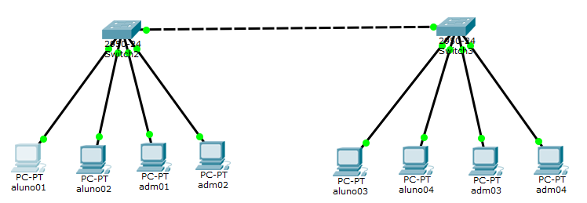

# Sobre:
Configuração de uma VLAN

# AMBIENTE



# Cenário:

## SWITCH 01

* fa 0/1 192.168.1.10
* fa 0/1 192.168.1.11

* fa 0/3 192.168.1.20
* fa 0/4 192.168.1.21

* fa 0/5 Mode: Trunk


---

## SWITCH 02

* fa 0/1 192.168.1.12
* fa 0/1 192.168.1.13

* fa 0/3 192.168.1.22
* fa 0/4 192.168.1.23

* fa 0/5 Mode: Trunk


---

# CONFIGURAÇÃO DOS SWHITCHS (VLAN)

>> Entrar no modo de superusuário

```

Switch>
Switch>enable

```

>> Entrar no modo de configuração

```

Switch#configure terminal

```

>> Criar uma VLAN

```
Switch(config)#vlan 100
Switch(config-vlan)#name alunos
Switch(config-vlan)#exit

Switch(config)#vlan 200
Switch(config-vlan)#name adm
Switch(config-vlan)#exit

```

>> Insrir uma porta em uma VLAN

```

Switch(config)#interface FastEthernet0/1
Switch(config-if)#switchport access vlan 100
Switch(config-if)#exit

Switch(config)#interface FastEthernet0/2
Switch(config-if)#switchport access vlan 100
Switch(config-if)#exit

```

>> Deixar a porta do switch em modo **Trunk**

```

Switch(config)#interface fastEthernet0/5
Switch(config-if)#switchport mode trunk
Switch(config-if)#exit

```
